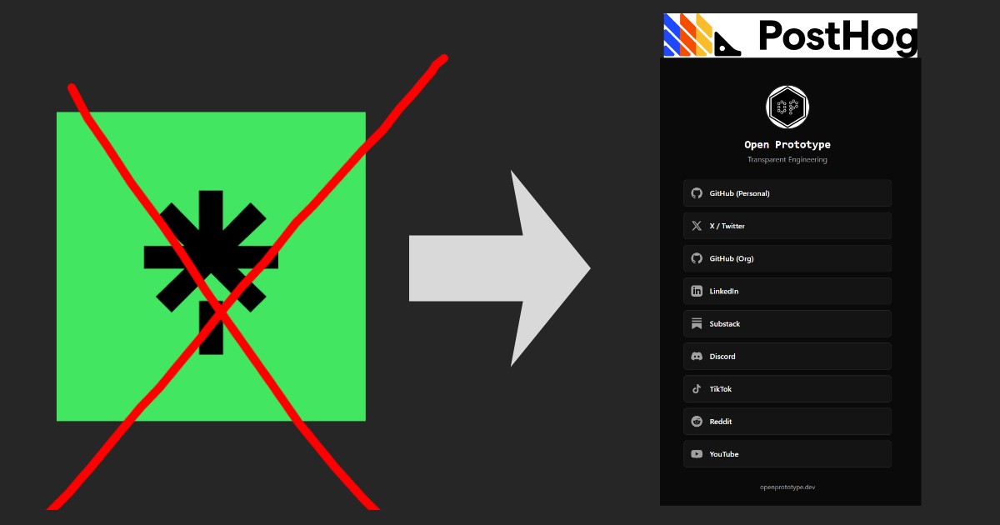

# OpenLinks



A minimal, self-hosted Linktree alternative with PostHog analytics.

**Live:** [links.openprototype.dev](https://links.openprototype.dev)

## Features

- **Static site** - No database, no server-side code
- **Fast** - Built with Astro, minimal JavaScript
- **Analytics** - PostHog integration for tracking
- **Privacy-first** - Cookie consent banner, GDPR compliant
- **Brand colors** - Each link has platform-specific hover colors
- **Share button** - Copy URL to clipboard
- **Dark theme** - Clean, modern design

## Stack

- [Astro](https://astro.build/) - Static site framework
- [Tailwind CSS](https://tailwindcss.com/) - Styling
- [PostHog](https://posthog.com/) - Analytics

## Quick Start

```bash
npm install
npm run dev
```

## Adding Links

Create a markdown file in `src/content/links/`:

```md
---
name: "GitHub"
url: "https://github.com/username"
icon: "github"
order: 1
---
```

**Available icons:** `github`, `twitter`, `linkedin`, `discord`, `youtube`, `tiktok`, `reddit`, `substack`, `email`, `portfolio`

## Deployment

Build command: `npm run build`
Output directory: `dist`

Deploy to Netlify, Vercel, Cloudflare Pages, or any static host.

## License

MIT
